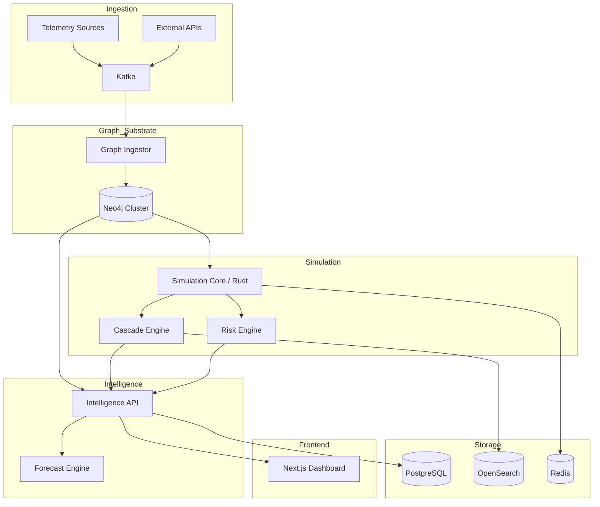
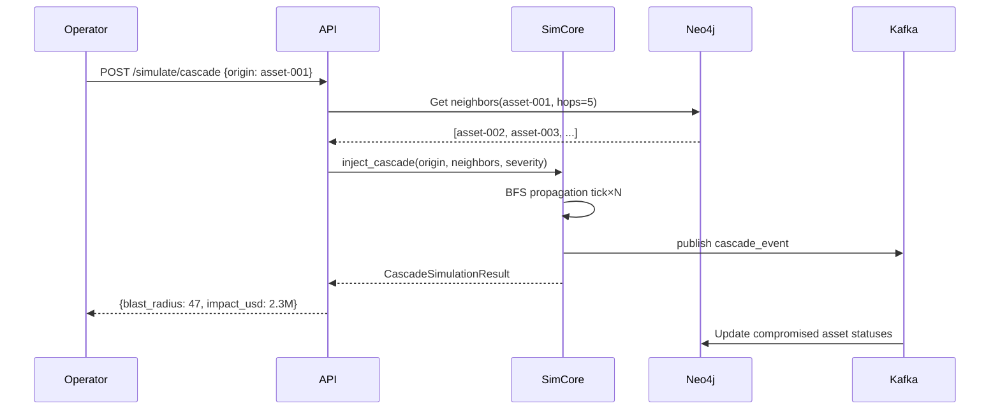

# AEGIS OMEGA X — MEGA LAYER 1
# PLANETARY DIGITAL TWIN
# OUTPUTS 3–20: Research, Threat Model, Scaling, Reliability, Security,
# Testing, CI/CD, Monitoring, Cost, Ops, DR, Formal Verification, Roadmap

---

## 3. RESEARCH OBJECTIVES

### 3.1 Primary Research Questions

1. **Scale**: Can a single graph substrate model 1B+ relationships while maintaining
   sub-100ms query latency for attack path analysis?

2. **Fidelity**: What is the minimum data required to produce a digital twin whose
   cascade predictions match real-world incident propagation within ±15%?

3. **Simulation Convergence**: What tick rate and propagation model produces stable,
   non-divergent risk scores across 10,000+ interconnected entities?

4. **Anomaly Detection on Graph**: Can GNN-based models outperform heuristic methods
   for detecting emerging cascades before they propagate?

5. **Economic Impact Modeling**: How accurately can the PDT estimate economic impact
   of a cyber event before human analysts can assess it?

### 3.2 Published Research Targets

- Graph-scale security simulation at civilizational scale (IEEE S&P / CCS)
- Cascade propagation modeling for interdependent critical infrastructure (USENIX)
- Digital twin fidelity benchmarking methodology (NDSS)

---

## 4. THREAT MODEL

### 4.1 Threats to the PDT Itself

| Threat                          | Actor              | Impact              | Mitigation                        |
|---------------------------------|--------------------|---------------------|-----------------------------------|
| Data poisoning (fake telemetry) | Nation-state       | False predictions   | Cryptographic telemetry signing   |
| API abuse (mass extraction)     | Competitor/spy     | IP theft            | Rate limiting, mTLS, RBAC         |
| Graph injection (fake assets)   | Insider            | Model corruption    | Write audit log, approval workflow|
| Simulation manipulation         | APT                | False sense of safety| Simulation integrity hashing     |
| Inference attack on twin data   | Adversary          | Reveal real topology| Differential privacy on outputs   |
| DoS against simulation core     | Hacktivists        | Blind spot creation | Redundant sim cores, rate limit   |
| Supply chain attack on deps     | Nation-state       | Full compromise     | SBOM, dependency pinning, signing |

### 4.2 Threats the PDT Models (Outward)

- Nation-state APT campaigns targeting multiple sectors simultaneously
- Ransomware supply chain cascades (SolarWinds-style)
- Cloud provider regional outage cascades
- AI ecosystem manipulation propagating through automated pipelines
- Critical infrastructure physical-cyber convergence events

### 4.3 Zero Trust Architecture for PDT

```
Every request to the PDT must:
  1. Present a valid short-lived JWT (max 1hr TTL)
  2. Present a client certificate (mTLS)
  3. Pass OPA policy evaluation
  4. Be logged with full telemetry
  5. Be rate-limited per identity
```

---

## 5. SCALING STRATEGY

### 5.1 Scale Targets

| Metric                     | Phase 1 (Now) | Phase 2 (6mo) | Phase 3 (18mo)  |
|----------------------------|---------------|---------------|-----------------|
| Entities                   | 1,000         | 10,000        | 1,000,000       |
| Assets per entity          | 100           | 1,000         | 10,000          |
| Total assets               | 100K          | 10M           | 10B             |
| Graph edges                | 1M            | 100M          | 1T              |
| Simulation ticks/sec       | 1             | 10            | 100             |
| API queries/sec            | 100           | 10,000        | 1,000,000       |
| Neo4j nodes                | 100K          | 100M          | 1B+             |

### 5.2 Horizontal Scaling Architecture

```
Phase 1:  3-node Neo4j Core cluster
Phase 2:  Neo4j Fabric (sharding across multiple databases)
Phase 3:  Domain-sharded graph substrate
          ├── Financial shard (Neo4j cluster 1)
          ├── Healthcare shard (Neo4j cluster 2)
          ├── Energy shard (Neo4j cluster 3)
          └── Enterprise shard (Neo4j cluster 4)
          Unified via PDT Graph Federation Layer (Go)
```

### 5.3 Read Scaling

- Neo4j read replicas per shard (3-5 per cluster)
- Redis cache layer for hot graph subgraphs
- CDN-cached simulation snapshots for dashboards
- gRPC streaming for real-time tick consumers

---

## 6. RELIABILITY STRATEGY

### 6.1 SLOs

| Component              | Availability Target | RTO     | RPO    |
|------------------------|---------------------|---------|--------|
| PDT Intelligence API   | 99.99%              | < 1min  | 0      |
| Neo4j Graph Cluster    | 99.99%              | < 5min  | < 10s  |
| Simulation Core        | 99.9%               | < 10min | < 1min |
| Kafka Event Bus        | 99.99%              | < 2min  | 0      |
| PostgreSQL             | 99.99%              | < 5min  | < 1s   |

### 6.2 Multi-Region Strategy

```
Primary:   ap-south-1  (Mumbai)      — Active writes
Secondary: us-east-1   (Virginia)    — Active reads + hot standby
Tertiary:  eu-west-1   (Ireland)     — Warm standby + disaster recovery
```

---

## 7. SECURITY CONTROLS

### 7.1 Data at Rest

- AES-256 encryption for all databases
- AWS KMS customer-managed key rotation (annual)
- Neo4j enterprise encryption at rest
- S3 SSE-KMS on all data lake buckets

### 7.2 Data in Transit

- TLS 1.3 minimum for all inter-service communication
- mTLS for Neo4j bolt connections
- Kafka TLS with SASL_SSL
- Certificate rotation automated via cert-manager

### 7.3 Access Control

- OPA (Open Policy Agent) for all API authorization
- RBAC with least privilege across all Kubernetes namespaces
- IAM roles (no IAM users) for AWS resources
- Service accounts with workload identity binding

### 7.4 Secrets Management

- HashiCorp Vault for secrets (with AWS KMS unsealing)
- Kubernetes external secrets operator
- No secrets in environment variables (mounted as volumes)
- Secret rotation automation for all database credentials

---

## 8. TESTING STRATEGY

### 8.1 Unit Tests

```
- data-model: 100% coverage for all dataclasses + validators
- cascade engine: deterministic tests with seeded RNG
- risk scoring: boundary tests (0.0, 0.5, 1.0 edge cases)
- API: pytest + httpx async test client
```

### 8.2 Integration Tests

```
- Neo4j: testcontainers-python with real Neo4j instance
- Kafka: embedded Kafka for event pipeline tests
- Full API against real DB: pytest-asyncio fixtures
```

### 8.3 Scale Tests

```
- k6 load testing: 10K concurrent API requests
- Cascade simulation under 100K assets
- Neo4j query performance benchmarks at 10M+ nodes
- Kafka throughput: 1M events/sec sustained
```

### 8.4 Chaos Engineering

```
- Chaos Mesh on Kubernetes
  - Neo4j node kill (test HA failover)
  - Kafka partition leader failure
  - Network partition between regions
  - Redis eviction storm
  - Simulation core OOM
```

---

## 9. CI/CD DESIGN

```yaml
# .github/workflows/pdt-ci.yml
name: PDT CI/CD

on:
  push:
    branches: [main, develop]
  pull_request:
    branches: [main]

jobs:
  test:
    runs-on: ubuntu-latest
    services:
      neo4j:
        image: neo4j:5.15
        env:
          NEO4J_AUTH: neo4j/testpassword
        ports: ["7687:7687"]
    steps:
      - uses: actions/checkout@v4
      - name: Python tests
        run: pytest --cov=. --cov-report=xml
      - name: Rust tests
        run: cargo test --release
      - name: Upload coverage
        uses: codecov/codecov-action@v3

  security-scan:
    runs-on: ubuntu-latest
    steps:
      - uses: actions/checkout@v4
      - name: Trivy scan
        uses: aquasecurity/trivy-action@master
        with:
          scan-type: fs
          severity: CRITICAL,HIGH
      - name: Semgrep SAST
        uses: returntocorp/semgrep-action@v1
      - name: pip-audit
        run: pip-audit -r requirements.txt
      - name: cargo-audit
        run: cargo audit

  build:
    needs: [test, security-scan]
    runs-on: ubuntu-latest
    steps:
      - name: Build Docker images
        run: |
          docker build -t aegis-omega-x/pdt-api:${{ github.sha }} .
          docker build -t aegis-omega-x/pdt-sim:${{ github.sha }} ./sim-core
      - name: Push to ECR
        run: |
          aws ecr get-login-password | docker login --username AWS \
            --password-stdin $ECR_REGISTRY
          docker push $ECR_REGISTRY/pdt-api:${{ github.sha }}

  deploy-staging:
    needs: build
    runs-on: ubuntu-latest
    environment: staging
    steps:
      - name: Helm upgrade staging
        run: |
          helm upgrade --install aegis-pdt ./helm \
            --namespace aegis-pdt-staging \
            --set image.tag=${{ github.sha }} \
            --values ./helm/values-staging.yaml

  deploy-production:
    needs: deploy-staging
    runs-on: ubuntu-latest
    environment: production
    if: github.ref == 'refs/heads/main'
    steps:
      - name: Helm upgrade production (blue-green)
        run: |
          helm upgrade --install aegis-pdt ./helm \
            --namespace aegis-pdt \
            --set image.tag=${{ github.sha }} \
            --values ./helm/values-production.yaml \
            --atomic --timeout 10m
```

---

## 10. MONITORING STRATEGY

### 10.1 Key Metrics (Prometheus)

```
pdt_simulation_tick_duration_ms        # Histogram
pdt_global_risk_score                  # Gauge
pdt_compromised_assets_total           # Counter
pdt_active_cascades                    # Gauge
pdt_api_request_duration_seconds       # Histogram (p50/p90/p99)
pdt_neo4j_query_duration_ms            # Histogram
pdt_kafka_consumer_lag                 # Gauge
pdt_graph_node_count                   # Gauge
pdt_cascade_events_total               # Counter
```

### 10.2 Alerts (Alertmanager)

```yaml
groups:
  - name: pdt-critical
    rules:
      - alert: GlobalRiskScoreSpike
        expr: pdt_global_risk_score > 0.85
        for: 2m
        annotations:
          summary: "Global planetary risk score above 0.85 — possible mass cascade"

      - alert: SimulationTickLag
        expr: pdt_simulation_tick_duration_ms > 5000
        for: 1m
        annotations:
          summary: "Simulation tick taking > 5s — scale compute"

      - alert: CompromisedAssetsExplosion
        expr: rate(pdt_compromised_assets_total[5m]) > 100
        annotations:
          summary: "Rapid asset compromise — active cascade likely"

      - alert: Neo4jClusterDegraded
        expr: neo4j_cluster_members_online < 2
        annotations:
          summary: "Neo4j cluster below quorum"
```

---

## 11. COST MODEL

### 11.1 Monthly AWS Cost Estimate (Production)

| Component                    | Instance/Size        | Monthly USD  |
|------------------------------|---------------------|--------------|
| EKS Control Plane (primary)  | Managed             | $144         |
| EKS Worker Nodes (m6i.4xl×6) | 6 × $0.768/hr       | $3,317       |
| EKS Neo4j Nodes (r6i.8xl×3)  | 3 × $2.016/hr       | $4,371       |
| EKS Compute Nodes (c6i.8xl×2)| 2 × $1.36/hr        | $1,958       |
| ElastiCache (r7g.4xl×3)      | 3 × $1.344/hr       | $2,914       |
| OpenSearch (r6g.4xl×3)       | 3 × $1.008/hr       | $2,177       |
| S3 Data Lake (10TB)          | $0.023/GB           | $230         |
| Data Transfer                | ~10TB/month         | $900         |
| KMS + Secrets Manager        | Minimal             | $50          |
| **Total (Primary Region)**   |                     | **~$16,061** |
| Multi-region ×2.5 factor     |                     | **~$40,152** |

### 11.2 Cost Optimization

- Spot instances for simulation workers (non-stateful) → 70% savings
- Reserved instances for Neo4j + PostgreSQL → 40% savings
- S3 Glacier for tick history > 90 days → 80% storage savings
- Karpenter for intelligent node provisioning

---

## 12. DISASTER RECOVERY

### 12.1 DR Runbook

**RTO: 5 minutes (API), 15 minutes (full simulation)**

**Scenario: Primary region (ap-south-1) total failure**

```
Step 1 (0–2min):
  - Route53 health check detects primary failure
  - DNS failover to secondary (us-east-1)
  - Load balancer traffic shifts to secondary EKS

Step 2 (2–5min):
  - Secondary Neo4j cluster (replica) promoted to primary
  - Kafka mirrors in secondary region promoted to primary
  - API pods in secondary begin accepting writes

Step 3 (5–15min):
  - Simulation core restarts in secondary
  - Loads last checkpoint from S3 (< 60s data loss)
  - Validates graph integrity before resuming ticks

Step 4 (15–30min):
  - Alert ops team via PagerDuty
  - Begin root cause analysis of primary region
  - Prepare primary region recovery
```

### 12.2 Backup Schedule

| Data                    | Frequency  | Retention | Location           |
|-------------------------|------------|-----------|-------------------|
| Neo4j full dump         | Daily      | 90 days   | S3 cross-region   |
| PostgreSQL WAL          | Continuous | 7 days    | S3 cross-region   |
| Simulation checkpoints  | Every 60s  | 7 days    | S3 cross-region   |
| Kafka topic snapshots   | Daily      | 30 days   | S3 cross-region   |

---

## 13. FORMAL VERIFICATION OPPORTUNITIES

### 13.1 Properties to Verify

1. **Access Control Completeness**: Prove that no identity can access an asset
   not in its access_map, regardless of call sequence.

2. **Cascade Containment**: Prove that cascade propagation halts within N hops
   when a containment boundary (firewall, air gap) is correctly modeled.

3. **Risk Score Monotonicity**: Prove that risk scores never decrease during
   an active cascade without an explicit remediation event.

4. **Graph Consistency**: Prove that all relationship source/target IDs
   reference existing asset nodes (referential integrity).

### 13.2 Tooling

- **TLA+**: Model cascade propagation termination
- **Alloy**: Verify access control model completeness
- **Coq**: Formalize risk score monotonicity theorem
- **Kani (Rust)**: Bounded model checking on simulation core

---

## 14. FUTURE EVOLUTION ROADMAP

### 14.1 Phase Timeline

```
Phase 1 (Months 1–3):     Foundation
  - 1,000 entities, 100K assets
  - Core simulation engine
  - Basic cascade modeling
  - REST API

Phase 2 (Months 4–6):     Scale
  - 10,000 entities, 10M assets
  - Neo4j Fabric sharding
  - Real telemetry ingestion
  - GNN-based cascade prediction

Phase 3 (Months 7–12):    Intelligence
  - 100,000 entities
  - 72-hour risk forecasting
  - AI agent integration (MEGA LAYER 4)
  - Multi-cloud federation

Phase 4 (Months 13–24):   Civilization
  - 1M+ entities
  - Real-time satellite telemetry
  - Quantum-safe cryptographic layer
  - Formal verification of critical paths
  - AR/VR visualization interface

Phase 5 (Years 3–20):     Evolution
  - Self-evolving twin models
  - Autonomous remediation federation
  - Planetary-scale digital-physical convergence
  - Integration with governmental cyber defense agencies
```

---

## 15. MERMAID DIAGRAMS

### 15.1 High-Level Architecture



### 15.2 Cascade Propagation Sequence


