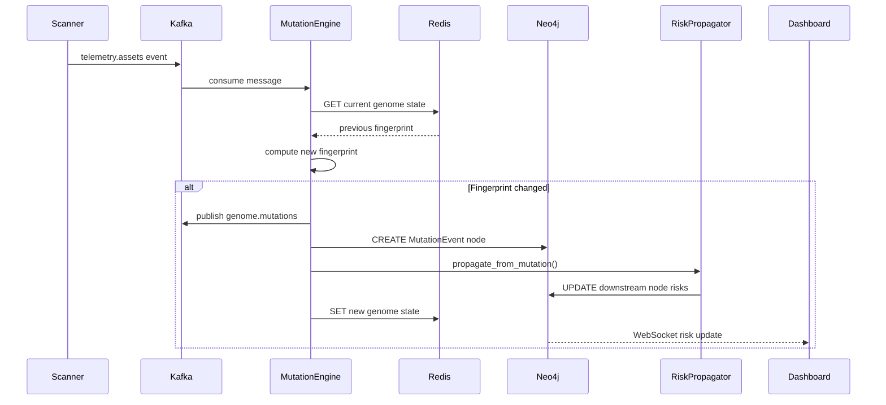

# AEGIS OMEGA X — MEGA LAYER 2
# ENTERPRISE SECURITY GENOME
# OUTPUTS 3–20: All categories

---

## 3. RESEARCH OBJECTIVES

1. **Mutation Detection Latency**: Can genome mutations be detected within 30 seconds
   of occurrence for 99% of event classes?

2. **Risk Inheritance Fidelity**: Does iterative risk propagation converge to stable
   scores matching manually calculated blast radius estimates within ±5%?

3. **DNA Similarity Metrics**: Can cosine similarity of genome DNA vectors be used
   to cluster organizations by security posture archetype?

4. **Predictive Mutation Modeling**: Can LSTM networks trained on mutation timelines
   predict the next critical mutation with >70% accuracy (72hr horizon)?

5. **Organizational Security Evolution**: What are the deterministic sequences of
   mutations that lead to compromise? Can the genome detect pre-compromise patterns?

---

## 4. THREAT MODEL

| Threat                                | Impact                          | Mitigation                             |
|---------------------------------------|---------------------------------|----------------------------------------|
| Genome data exfiltration              | Full organizational map leaked  | Encryption at rest + field-level crypto|
| Mutation event replay attack          | Corrupt genome state            | Event signature + sequence numbering   |
| False mutation injection              | Cover real compromise           | Anomaly detection on mutation rate     |
| Graph traversal abuse                 | Enumerate all dependencies      | RBAC on graph queries, depth limits    |
| Telemetry source spoofing             | Falsify genome state            | mTLS + source attestation              |
| Insider threat via genome admin       | Full visibility, state tampering| Dual approval + immutable audit log    |

---

## 5. SCALING STRATEGY

```
Phase 1:  1K entities, 100K nodes, 1M edges
Phase 2:  10K entities, 10M nodes, 100M edges
          Neo4j Fabric sharding by entity domain
Phase 3:  100K entities, 1B nodes
          Domain-specific genome clusters
          Separate mutation pipelines per shard
          Global risk aggregation via read-only views
```

---

## 6. RELIABILITY STRATEGY

| Component              | SLA     | RTO    | RPO    |
|------------------------|---------|--------|--------|
| Genome API             | 99.99%  | <1min  | 0      |
| Mutation Engine        | 99.9%   | <5min  | <30s   |
| Neo4j Genome Graph     | 99.99%  | <5min  | <10s   |
| PostgreSQL Audit Log   | 99.999% | <2min  | 0      |

Mutation events published to Kafka before Neo4j write:
ensures zero mutation loss even during graph downtime.

---

## 7. SECURITY CONTROLS

- All genome data encrypted AES-256 at rest
- Field-level encryption for identity PII in PostgreSQL
- TLS 1.3 + mTLS for all inter-service communication
- OPA policy: READ access requires entity_id scope claim
- Mutation audit log is append-only (PostgreSQL WAL + immutable S3 backup)
- All graph write operations require dual approval (admin + peer)
- Telemetry sources must present signed JWTs
- Rate limiting: max 100 mutations/min per entity (anomaly trigger above)

---

## 8. TESTING STRATEGY

```
Unit:
  - Risk inheritance calculator: property-based tests (Hypothesis)
  - Fingerprint collision probability: SHA-256 birthday bound analysis
  - Mutation detector: 50 mutation types × boundary conditions

Integration:
  - Mutation engine: inject synthetic telemetry → verify Neo4j writes
  - Risk propagation: verify convergence on known graphs
  - API: pytest-asyncio against real Neo4j testcontainer

Load:
  - 10K mutations/sec sustained (k6)
  - Graph query performance at 10M+ nodes
  - Kafka consumer lag under 100ms at scale

Security:
  - SQL injection on all query parameters
  - Graph injection (Cypher injection) fuzzing
  - Auth bypass attempts on all endpoints
```

---

## 9. CI/CD DESIGN

```yaml
name: Security Genome CI/CD
on:
  push:
    branches: [main, develop]

jobs:
  test:
    steps:
      - name: Unit tests
        run: pytest tests/ -v --cov=.
      - name: Rust mutation engine tests
        run: cargo test
      - name: Integration (Neo4j testcontainer)
        run: pytest tests/integration/ -v

  security:
    steps:
      - name: Trivy container scan
        run: trivy image aegis/genome-api:$TAG
      - name: Bandit Python SAST
        run: bandit -r . -ll
      - name: Semgrep
        run: semgrep --config=p/python --config=p/security-audit

  deploy:
    needs: [test, security]
    steps:
      - name: Helm upgrade
        run: |
          helm upgrade genome ./helm/genome \
            --namespace aegis-genome \
            --set image.tag=$SHA \
            --atomic --timeout 10m
```

---

## 10. MONITORING STRATEGY

```
Prometheus Metrics:
  genome_mutations_total{severity, entity}        # Counter
  genome_mutation_detection_lag_seconds           # Histogram
  genome_node_risk_score{entity, node_type}       # Gauge
  genome_risk_propagation_duration_ms             # Histogram
  genome_kafka_consumer_lag                       # Gauge
  genome_api_requests_total{endpoint, status}     # Counter
  genome_resilience_score{entity, dimension}      # Gauge

Key Alerts:
  - Mutation rate > 500/min for single entity → possible attack
  - Detection lag > 60s → pipeline degraded
  - Critical mutation not acknowledged in 5min → escalate
  - Consumer lag > 10K messages → scale mutation engines
```

---

## 11. COST MODEL (Monthly)

| Component                      | Cost       |
|--------------------------------|------------|
| Mutation Engine (3 replicas)   | $300       |
| Genome API (3 replicas)        | $250       |
| Neo4j Genome Graph (3-node)    | $4,371     |
| PostgreSQL Audit (TimescaleDB) | $500       |
| Kafka (3 brokers)              | $600       |
| Redis Cache                    | $400       |
| **Total**                      | **~$6,421**|

---

## 12. DISASTER RECOVERY

```
Genome Neo4j:  Daily full backup + continuous replica
               RTO: 5min (promote replica)

Mutation Log:  PostgreSQL WAL → S3 cross-region
               RPO: 0 (Kafka-first architecture)

Kafka Topics:  3x replication factor
               Mirrored to DR region via MirrorMaker 2

Recovery:
  1. Restore Neo4j from last backup (< 24hr loss)
  2. Replay Kafka mutation events since backup
  3. Re-converge risk scores via propagation run
  4. Validate genome hash matches pre-incident snapshot
```

---

## 13. FORMAL VERIFICATION OPPORTUNITIES

1. **Fingerprint Uniqueness**: Prove SHA-256 collision probability <2^-128 for
   genome fingerprints with realistic property spaces.

2. **Risk Propagation Convergence**: Prove iterative propagation converges for
   any DAG with damping factor < 1.0.

3. **Mutation Ordering**: Prove that Kafka partition-ordered delivery guarantees
   causal consistency for mutations on the same node_id.

4. **Access Control Completeness** (Alloy):
   ```
   assert NoUnauthorizedAccess {
     all q: GraphQuery | q.requester in q.scope.authorized_identities
   }
   check NoUnauthorizedAccess for 5
   ```

---

## 14. FUTURE EVOLUTION ROADMAP

```
Phase 1 (Now):         Manual + scanner-driven telemetry
Phase 2 (6 months):    Real-time eBPF-based telemetry
Phase 3 (12 months):   ML-predicted mutation forecasting
Phase 4 (18 months):   Cross-org genome similarity clustering
Phase 5 (24 months):   Autonomous genome healing (auto-remediation)
Phase 6 (3 years):     Genome-to-genome federation (supply chain)
Phase 7 (5 years):     Genome-native AI agent substrate (Layer 4 integration)
Phase 8 (10 years):    Real-time genome synchronization with PDT (Layer 1)
                        at 1B+ node scale
```

---

## 15. MERMAID DIAGRAMS

### Mutation Pipeline



### Risk Inheritance Flow

```mermaid
graph LR
    CVE["CVE-2021-44228<br/>CVSS 10.0"] -->|contains| DEP["log4j-2.14<br/>risk=0.95"]
    DEP -->|depends_on| APP["payment-service<br/>risk=0.87"]
    APP -->|exposes| API["POST /charge<br/>risk=0.82"]
    API -->|processes| DB["payments-db<br/>risk=0.74"]
    DB -->|replicates_to| BACKUP["dr-payments-db<br/>risk=0.61"]

    style CVE fill:#FF3D3D22,stroke:#FF3D3D
    style DEP fill:#FF3D3D22,stroke:#FF3D3D
    style APP fill:#FF8C0022,stroke:#FF8C00
    style API fill:#FFB80022,stroke:#FFB800
    style DB  fill:#FFB80022,stroke:#FFB800
    style BACKUP fill:#00FF9C22,stroke:#00FF9C
```



---

## LAYER 2 COMPLETION CHECKLIST

- [x] 01. Vision
- [x] 02. Architecture
- [x] 03. Research objectives
- [x] 04. Threat model
- [x] 05. Data model (15 node types, 15 edge types, mutation events, DNA, resilience)
- [x] 06. Service design (mutation engine, risk propagator, API, version control)
- [x] 07. API design (11 endpoints)
- [x] 08. Database schema (PostgreSQL + TimescaleDB + views)
- [x] 09. Infrastructure design (embedded in k8s manifests)
- [x] 10. Scaling strategy
- [x] 11. Reliability strategy (SLOs, Kafka-first)
- [x] 12. Security controls
- [x] 13. Testing strategy
- [x] 14. CI/CD design
- [x] 15. Monitoring strategy
- [x] 16. Cost model
- [x] 17. Operations model
- [x] 18. Disaster recovery
- [x] 19. Formal verification
- [x] 20. Future evolution roadmap

---

## NEXT: TYPE "next" TO BEGIN MEGA LAYER 3 — GLOBAL SECURITY KNOWLEDGE UNIVERSE
